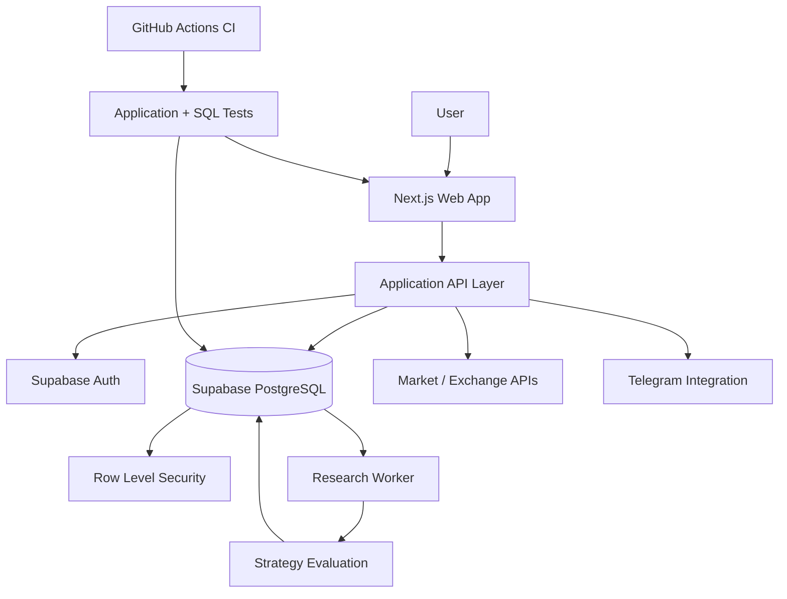

# Architecture

## Main components

### Web application
Next.js + TypeScript UI for portfolio overview, journal, strategy scenarios and settings.

### API layer
Typed application endpoints for market data, strategy evaluation, journal workflows and integrations.

### Supabase
Authentication, PostgreSQL persistence, migrations and Row Level Security.

### Research worker
Background research and diagnostics used to evaluate strategy hypotheses and store evidence.

### External integrations
Read-only market/exchange data and Telegram notifications.

### CI
Automated checks for application logic, database behavior and security boundaries.
