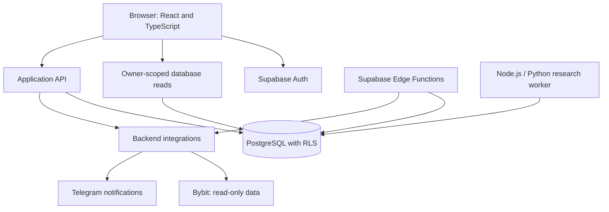

# Architecture

TradePilot has a web interface, Supabase backend and a separate research worker. Notifications and exchange access are backend integrations; they are not steps through which every research request passes.

The diagram shows responsibilities, not every endpoint or scheduled job.

## Web and backend

The React/TypeScript interface uses Next.js-style routes with Vinext/Vite. It displays journal records, market observations, research status and system health.

Authenticated browser code can read owner-scoped Supabase data under RLS. Operations involving private integration credentials run through backend code. Supabase Edge Functions handle scheduled integration work separately from page requests.

PostgreSQL stores account-related records, journal data, strategy configuration and research evidence. Migrations and SQL tests are versioned in the private repository.

## Research worker

The research worker is separate from the web-serving runtime. Node.js handles worker orchestration and Python implements offline calculations. Jobs and results are tracked independently of the page lifecycle.

A result is evidence for review. It does not automatically activate a strategy or grant trading permissions. Defined dataset boundaries and execution assumptions are part of an evaluation, including when the result is negative.

## Example: health checks during refresh

A watchlist refresh can start several market requests while the dashboard also asks for system health. Unbounded refresh traffic and duplicate diagnostic work can compete for database time.

Market refresh concurrency is limited to four. The health request retries a statement timeout once after a short delay; it does not retry an authentication failure or indefinitely repeat a failing request. The interface reports a persistent timeout rather than treating missing health data as a successful check.

## Runtime and deployment

The private repository builds the web application and a Cloudflare worker bundle. The research worker is a different program, not that web-serving worker.

Build checks and a successful GitHub merge are separate from publishing the hosted application. A repository update alone does not establish which revision is live.
