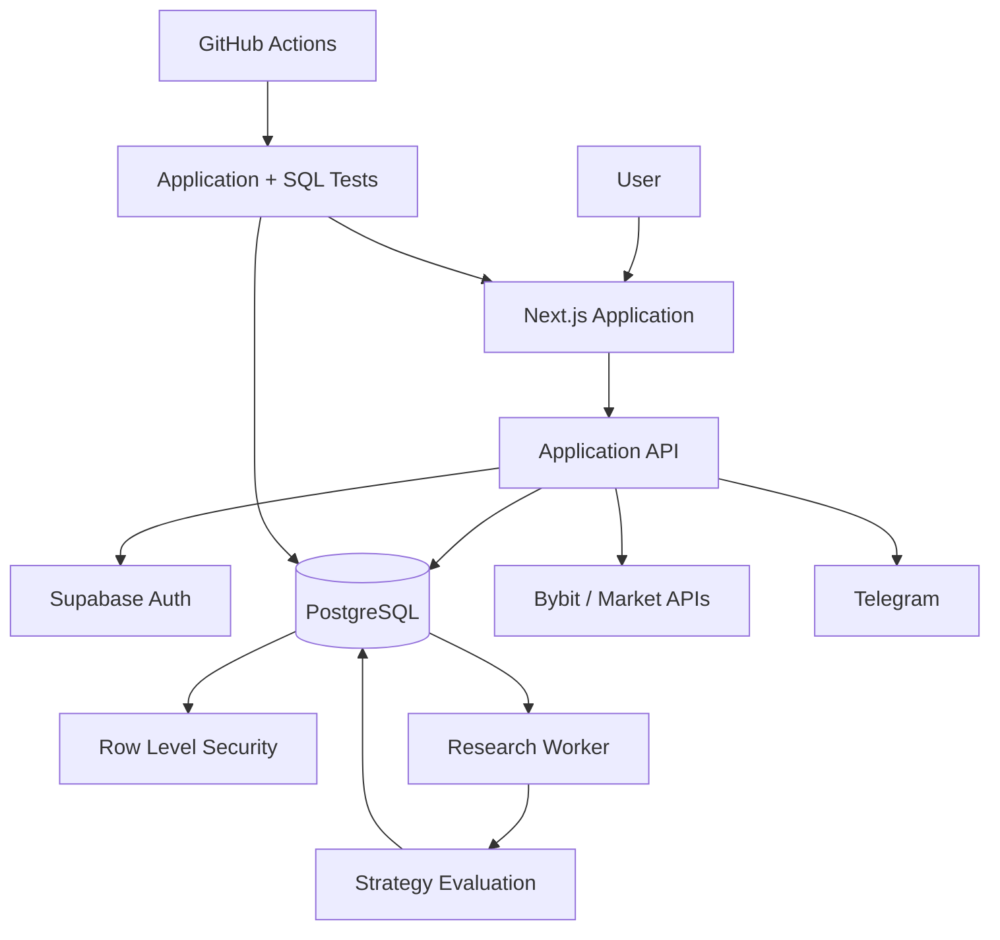

# Architecture

TradePilot AI is split into the web application, database layer, external integrations and a separate research worker.

## Web Application

The Next.js application provides the portfolio view, journal, strategy scenarios, research status and system health screens.

User-facing requests go through the application API rather than giving the browser direct access to privileged integrations.

## Database

Supabase PostgreSQL stores application state, journal data, strategy configuration and research evidence.

Row Level Security is used for owner-scoped data.

Database changes are managed through migrations and tested separately from the frontend.

## Exchange Integration

The application reads account, execution and market data from Bybit.

Exchange access used by the research system is read-only. Research code does not have trade execution authority.

## Research Worker

Research and diagnostics run outside the normal web request lifecycle.

The worker reads the required historical data, evaluates registered research tasks and writes evidence back to PostgreSQL.

Research results do not automatically become active trading behavior.

## Telegram

Telegram is used for application notifications.

Telegram credentials are not exposed to the browser.

## CI

GitHub Actions checks application code and database behavior independently.

The test suite includes TypeScript/application checks and SQL-level security tests.

## System Boundaries

- browser code does not receive exchange private credentials
- user-owned database rows are protected by RLS
- research workers are separated from trade execution
- experimental results are stored independently from active application state
- production secrets are not included in this public showcase
