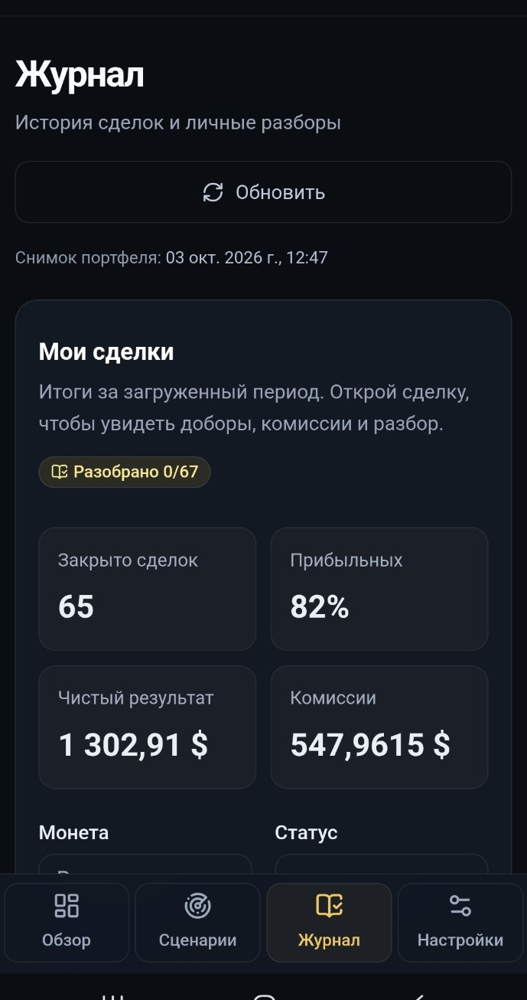
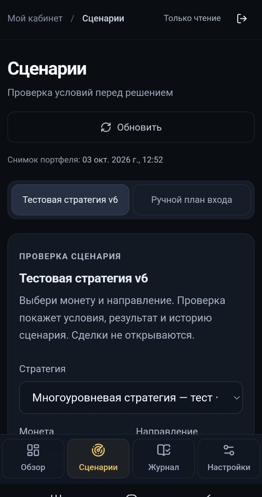
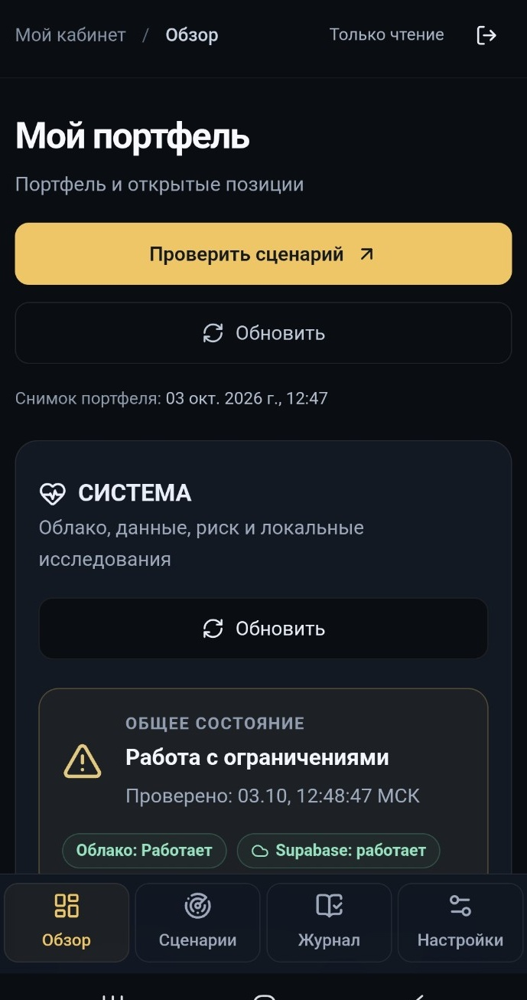

# TradePilot AI

TradePilot helps review exchange activity and test trading ideas. It brings account data, a trade journal, market observations and research results into one application.

The source repository is private. This public showcase contains screenshots of the Russian-language interface and implementation notes; it has no runnable application or test suite.

## What the application does

Users can review imported Bybit data, inspect journal entries, record a trade review and configure strategy scenarios. Background tasks refresh data and run research separately from the web interface. Telegram provides notifications.

The exchange connection is read-only. Research output does not authorize an order or activate a strategy.

## Screenshots

### Trade journal

### Strategy scenarios

### Overview

## Implementation

PostgreSQL Row Level Security restricts user-owned records. SQL tests check access under different user identities, including attempts to read another user's data.

Research runs in a separate Node.js/Python worker, with its own job and result records. Research history retains negative results alongside the dataset and execution assumptions used for each evaluation.

## Technology and boundaries

The web layer uses React, TypeScript and Next.js-style routing through Vinext/Vite. Supabase provides authentication, PostgreSQL and Edge Functions. Bybit supplies exchange data; Telegram handles notifications; a separate research worker runs Node.js/Python jobs.

[Architecture and data flow](ARCHITECTURE.md) · [Security boundaries and checks](SECURITY_AND_TESTING.md)

The public repository contains no credentials or account datasets. Research results are not a claim of profitable trading.
